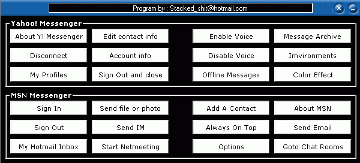



## Click On Any Menu

### Description

Click on any menu in any programs with this - Like you can click on Yahoo messenger menus and any other windows . you give the menu name to it and it will click on it . a must have for all
 
### More Info
 
Windows handels ( HWND )

             |
---                |---
**Submitted On**   |2002-10-17 01:34:40
**By**             |[Oooshofdds](https://github.com/Planet-Source-Code/PSCIndex/blob/master/ByAuthor/oooshofdds.md)
**Level**          |Advanced
**User Rating**    |5.0 (10 globes from 2 users)
**Compatibility**  |VB 3\.0, VB 4\.0 \(16\-bit\), VB 4\.0 \(32\-bit\), VB 5\.0, VB 6\.0
**Category**       |[Windows API Call/ Explanation](https://github.com/Planet-Source-Code/PSCIndex/blob/master/ByCategory/windows-api-call-explanation__1-39.md)
**World**          |[Visual Basic](https://github.com/Planet-Source-Code/PSCIndex/blob/master/ByWorld/visual-basic.md)
**Archive File**   |[Click\_On\_A14765210172002\.zip](https://github.com/Planet-Source-Code/oooshofdds-click-on-any-menu__1-39913/archive/master.zip)

